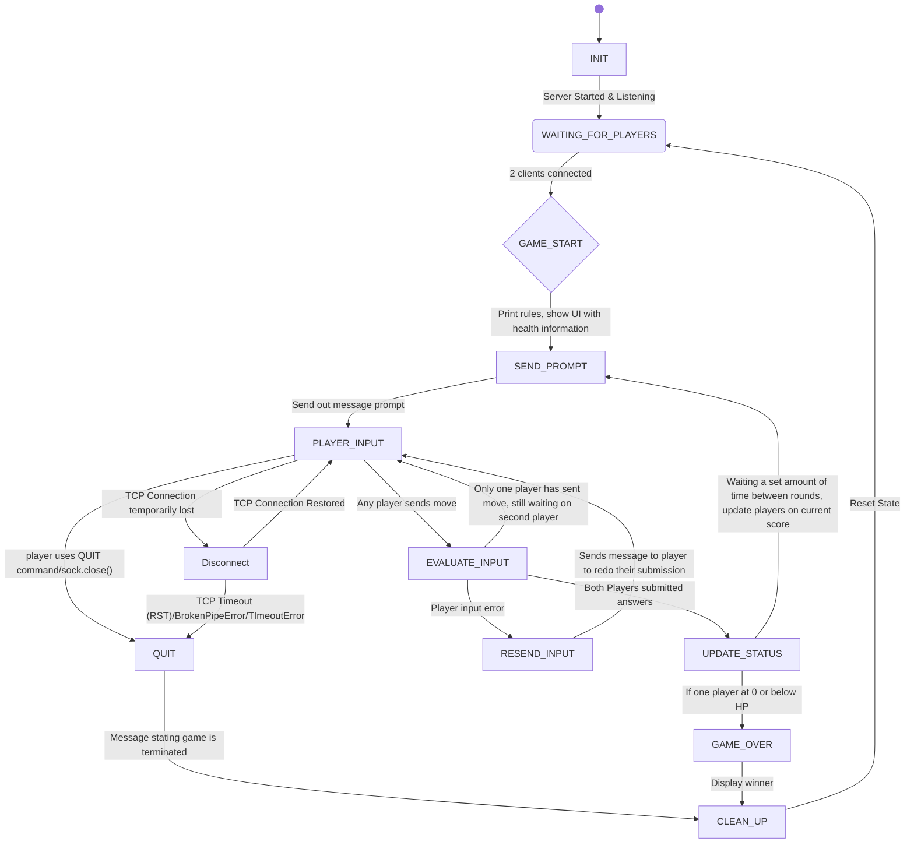

```mermaid
flowchart TB
    A["INIT"] -- Server Started &amp; Listening --> B("WAITING_FOR_PLAYERS")
    B -- 2 clients connected --> C{"GAME_START"}
    n1["Filled Circle"] --> A
    D["PLAYER_INPUT"] -- Any player sends move --> n2["EVALUATE_INPUT"]
    C -- Print rules, show UI with health information --> n4["SEND_PROMPT"]
    n4 -- Send out message prompt --> D
    n3["CLEAN_UP"] -- Reset State --> B
    n2 -- Only one player has sent move, still waiting on second player --> D
    D -- "player uses QUIT command/sock.close()" --> n5["QUIT"]
    n5 -- Message stating game is terminated --> n3
    D -- TCP Connection temporarily lost --> n6["Disconnect"]
    n6 -- TCP Timeout (RST)/BrokenPipeError/TImeoutError --> n5
    n6 -- TCP Connection Restored --> D
    n2 -- Player input error --> n7["RESEND_INPUT"]
    n7 -- Sends message to player to redo their submission --> D
    n2 -- Both Players submitted answers --> n8["UPDATE_STATUS"]
    n8 -- Waiting a set amount of time between rounds, update players on current score --> n4
    n8 -- If one player at 0 or below HP --> n9["GAME_OVER"]
    n9 -- Display winner --> n3

    n1@{ shape: f-circ}

```
